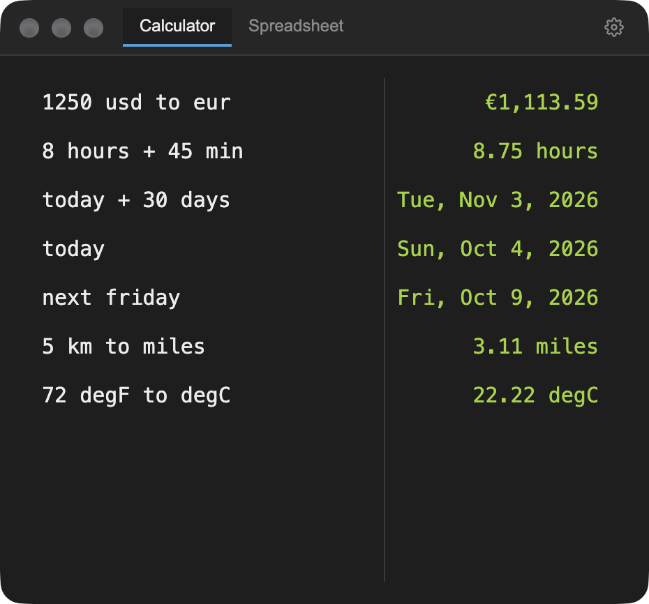
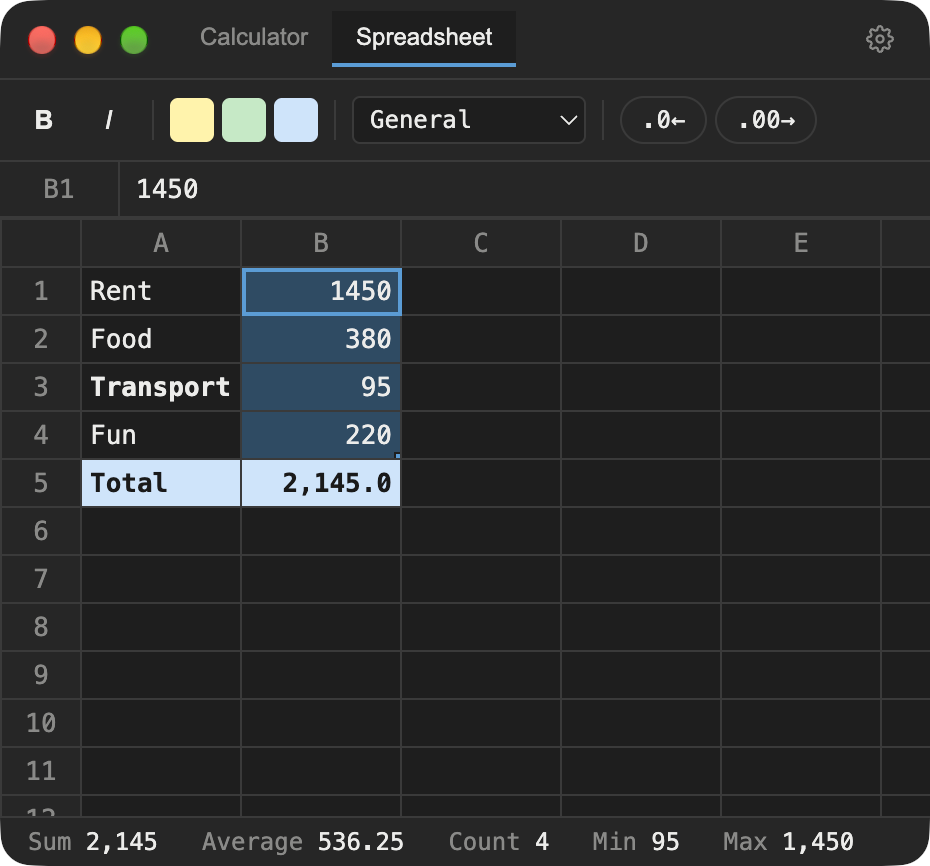
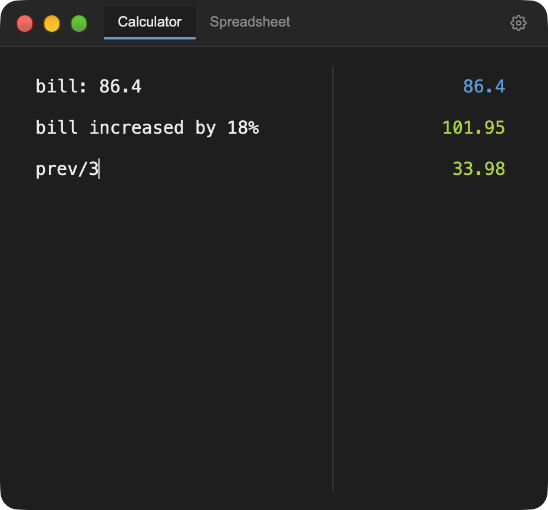
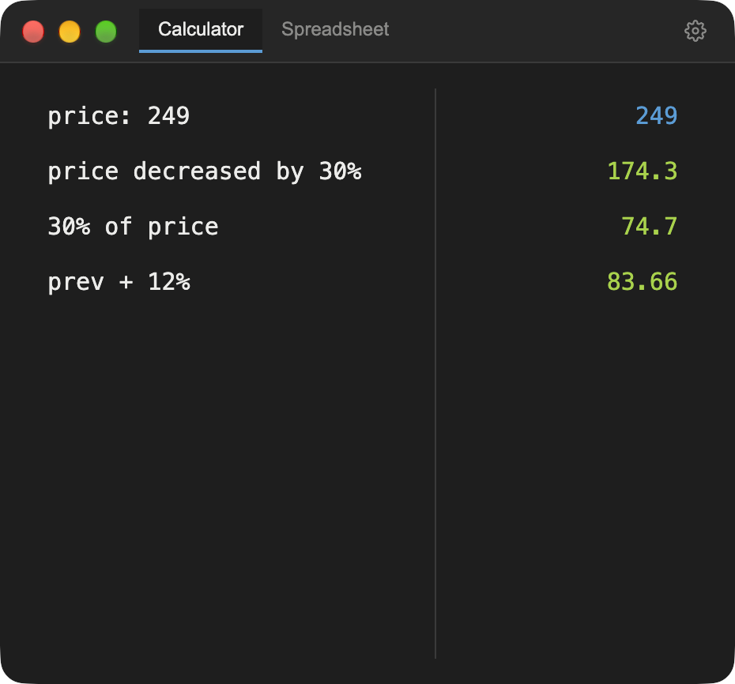
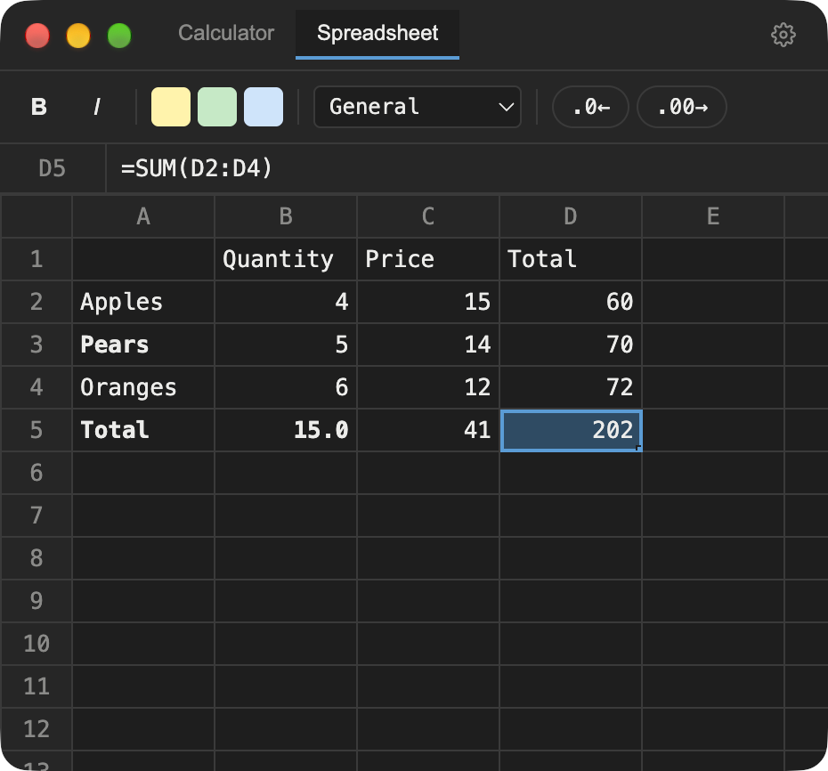

# PAPI

<p align="center">
  
  
</p>

A small macOS menu-bar app with two tabs, always one shortcut away
(default **⌥'**):

- **Calculator** — a Numi-style notepad: type natural-language math on
  each line and see live results next to it.
  - Arithmetic: `+ - * / ^`, parentheses, `mod`, and functions such as
    `sqrt`, `abs`, `round`, `floor`, `ceil`, `log`, `exp`, `sin`/`cos`/`tan`,
    `factorial`; constants `pi`, `e`.
  - Variables and labels: `x = 5`, `Rent: 1200`, `item 2000`; `prev` is the
    last result.
  - Blocks (separated by a blank line): `sum`, `average`, `min`, `max`,
    usable alone or inside an expression (`sum - 100`).
  - Percentages: `20% of 80`, `100 increased by 20%`, `100 + 10%`, and with
    a variable or `prev` as the base (`rent increased by 5%`).
  - Units: mass, length, volume, time, temperature, data, area, speed
    (`5 lb to kg`, `60 mi/h to km/h`, `100 m2 to sqft`), and duration
    math (`2h + 35min`).
  - Currencies: `1 usd to chf` (USD, EUR, GBP, CHF, JPY; live daily rates).
  - Dates: `today`, `next friday`, `3 months ago`, `today + 14 days`.
  - Click a result to copy it. Drag the divider to resize the columns; long
    lines wrap. Precision (0–10 decimals) is a setting.
- **Spreadsheet** — a 50-row × 26-column (A–Z) grid with live formulas,
  cell references (`A1`, `$A$1`) and ranges (`A1:B10`), a formula bar,
  copy/paste that adjusts relative references, fill-down, undo/redo, and
  bold/italic/fill colors. Powered by [HyperFormula](https://hyperformula.handsontable.com/),
  which provides about 400 Excel-compatible functions, including:
  - **Math:** `SUM`, `SUMIF`, `SUMIFS`, `SUMPRODUCT`, `PRODUCT`, `ROUND`,
    `ROUNDUP`, `ROUNDDOWN`, `ABS`, `MOD`, `POWER`, `SQRT`, `CEILING`, `FLOOR`
  - **Statistics:** `AVERAGE`, `AVERAGEIF`, `MEDIAN`, `MIN`, `MAX`, `COUNT`,
    `COUNTA`, `COUNTIF`, `COUNTIFS`, `LARGE`, `SMALL`, `STDEV`, `VAR`,
    `PERCENTILE`
  - **Logic:** `IF`, `IFS`, `IFERROR`, `AND`, `OR`, `NOT`, `SWITCH`
  - **Lookup:** `VLOOKUP`, `HLOOKUP`, `XLOOKUP`, `INDEX`, `MATCH`
  - **Finance:** `PMT`, `FV`, `PV`, `NPV`, `IRR`, `RATE`
  - **Text:** `CONCATENATE`, `LEFT`, `RIGHT`, `MID`, `LEN`, `UPPER`, `LOWER`,
    `TRIM`, `TEXT`
  - **Date:** `TODAY`, `NOW`, `DATE`, `YEAR`, `MONTH`, `DAY` (dates show as
    serial numbers; there is no date formatting yet)

  Circular references and bad formulas show standard errors (`#DIV/0!`,
  `#NAME?`, `#REF!`, `#VALUE!`) instead of crashing. The full list is in
  HyperFormula's [function reference](https://hyperformula.handsontable.com/guide/built-in-functions.html).
- **App** — lives in the menu bar, toggles with a global shortcut (default
  ⌥', changeable in Settings), optional launch at login, automatic updates
  (opt-out), remembers your last tab, and opens on whichever Space you're on.

Everything is saved automatically on your Mac.

## What it looks like

Type plain language on the left, see the answer on the right:

<p align="center">
  
  
</p>

The spreadsheet shows Sum, Average, Count, Min and Max for whatever you
select, and outlines the cells a formula refers to while you type it:

<p align="center">
  
</p>

## Install

Download the latest version (these links always point at the newest
release):

- **Apple Silicon** (M1 and later):
  [PAPI-arm64.dmg](https://github.com/cezarhere/papi/releases/latest/download/PAPI-arm64.dmg)
- **Intel Macs:**
  [PAPI-x64.dmg](https://github.com/cezarhere/papi/releases/latest/download/PAPI-x64.dmg)

Not sure which? Apple menu → About This Mac: "Chip: Apple M…" is Apple
Silicon, "Processor: Intel…" is Intel. Open the file and drag PAPI to
Applications. All releases are on the [Releases](../../releases) page. Builds
are signed and notarized by Apple, so they open without security warnings.

## Privacy

PAPI has no accounts, analytics or telemetry. Your data stays in
`~/Library/Application Support/PAPI`. It makes two kinds of network request:

- Once a day, it fetches currency exchange rates from
  [frankfurter.dev](https://frankfurter.dev) (no personal data sent);
  offline, it falls back to bundled rates.
- A few times a day, it asks this project's GitHub releases whether a newer
  version exists, and downloads it in the background if so (you're asked
  before restarting). Turn this off in **Settings → Check for updates
  automatically**; **Check for Updates…** in the menu-bar menu still works
  on demand.

## Build from source

```
npm install
npm run electron:dev      # run in Electron with hot reload
npm run dev               # plain browser (no tray/shortcut features)
npm run typecheck && npm run typecheck:electron
npm run electron:package  # unsigned local .app in release/
npm run dist              # signed + notarized DMG (needs Apple credentials)
```

To regenerate the icon: `python3 build/make-icon.py` (needs Pillow).

## Releasing

Push a `v*` tag; `.github/workflows/release.yml` builds, signs,
notarizes and publishes to GitHub Releases. See the header of that file
for the required repository secrets.

## Docs

`SPEC.md`, `CALC_SPEC.md`, `DESIGN.md` and `TESTING.md` describe
requirements, design tokens and a manual test checklist.

## License

[GPL-3.0](LICENSE). PAPI uses HyperFormula under its GPLv3 license, which
requires derivative works to be GPL-compatible as well.

## Reporting bugs

Use **Report a Bug…** in the menu-bar icon's menu — it opens a GitHub issue
pre-filled with your PAPI and macOS version — or
[open an issue](../../issues/new/choose) directly. For calculator bugs,
include the exact lines you typed.
